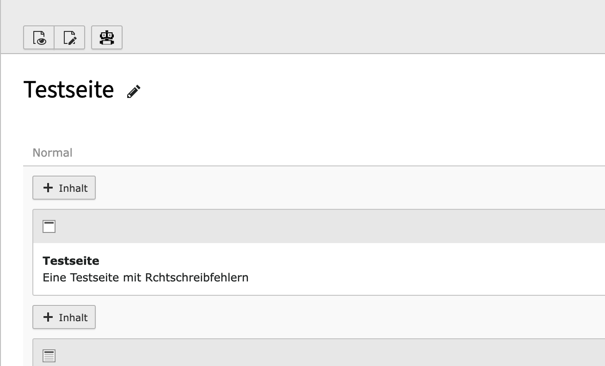
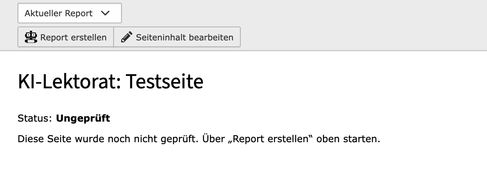
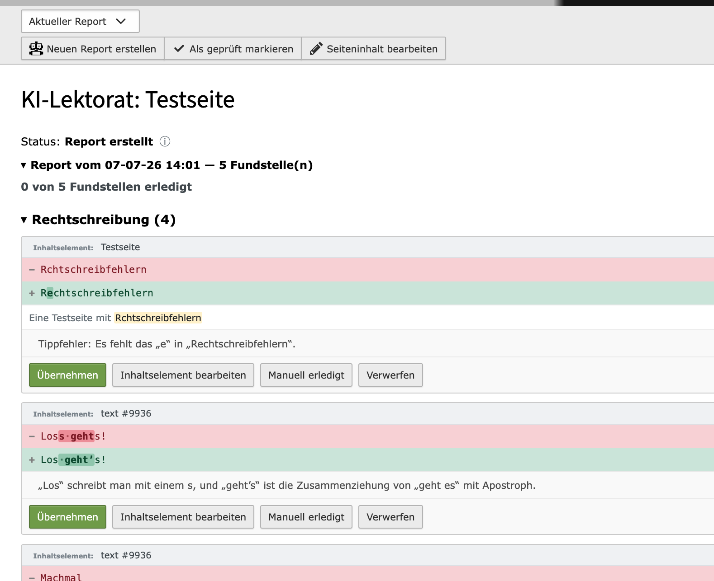

# AI Proof Reader for Typo3

*An exercise in vibe-coding. Fully developed by Claude Code / Opus 4.8 - heavily guided and reviewed, but almost no code was handwritten.*

AI-assisted proofreading for TYPO3 page content. Detects issues
like spelling, punctuation, grammar, gender-inclusive language, style.
Results are shown in a dedicated report.

> **Status: alpha.** Works and is in production use on TYPO3 11, but has **not** been widely tested.
> See "Limitations" below.
> If you are using this, please report any issues!

## Limitations

This is an early exploratory version with serious limitations:

- **German content only.** The A.I. prompt was optimized over multiple iterations for German language content only!
- **Single backend: OpenRouter** The general idea is to support generic OpenAI-compatible backends, but I have not been able to test this with anything other than OpenRouter yet. There can be serious limitations with availability and strictness of the required JSON output format that need to be tested.
- **Single page language only.** So far, only l=0 can be checked.
- **No workspace support.** The extension reads and reports on live content only; workspaces are ignored and untested.
- Only **tested** on Typo3 11. Targets Typo3 11-13, but 12-13 are thus untested.

## How it works

- Access the new module **"KI-Lektorat"** from any page:

  
  
- Checks need to be scheduled ("Report erstellen"). Depending on settings the check can take multiple minutes.

  
  
- When ready, the report is automatically shown:

  

## Installation

- **TYPO3:** 11.5 / 12.4 / 13.4 · **PHP:** 8.2+

```bash
composer require bmorg/ai_proofread
```

Or download via [Github Releases](https://github.com/bmorg/ai_proofread/releases).

In the TYPO3 backend:

1. **Database migration** Via Admin Tools → Maintenance → Analyze Database Structure
2. Extension configuration (see below).
3. **Scheduler task** Register the command **`aiproofread:process-queue`** as a recurring Scheduler task (every 60s).

## Configuration

# 1. Extension settings

Admin Tools → Settings → Extension Configuration → `ai_proofread`

Fill in at least the provider settings. Recommended:

| Setting | Value                                                                                   |
|---|-----------------------------------------------------------------------------------------------|
| `baseUrl` | `https://openrouter.ai/api/v1`                                                        |
| `apiKey` | `sk-or-…`                                                                              |
| `requestTimeout` |                                                                                |
| `maxConcurrency` |                                                                                |
| `useMock` | `0`                                                                                   |

And for the LLM prompt:

| Setting | Value |
|---------|-------|
| `siteDescription` | For better context |
| `extraPromptInstructions` | Allows adding of custom rules |
| `enableStyle` | `1` |
| `enableGenderInclusiveLanguage` | `1` |
| `genderInclusiveStyle` | E.g. "Nutzer/innen" |

### 2. Model selection (KI-Lektorat → Dropdown: Einstellungen)

Comes with a few preconfigured models for testing.

Recommended:
- **Reasoning on** gives much better results (slower and more expensive).
- **Pin a provider** (e.g. `anthropic`) if the default routing lands on providers that e.g. don't return the required JSON.

## License

MIT — see [LICENSE](LICENSE).
